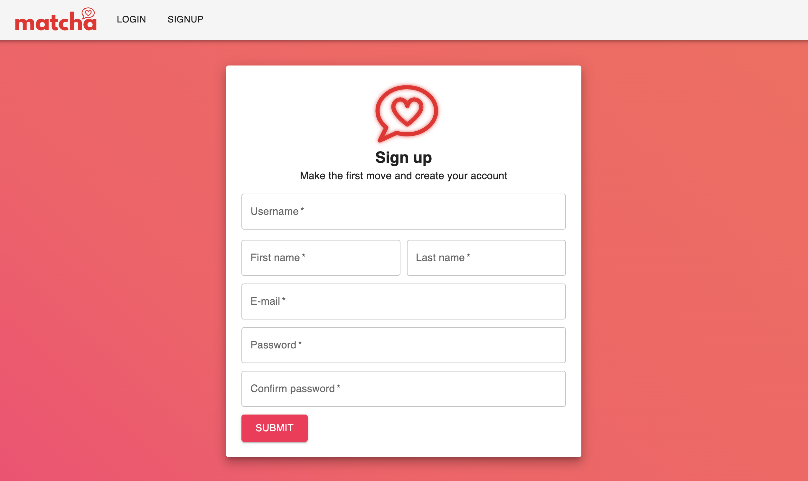
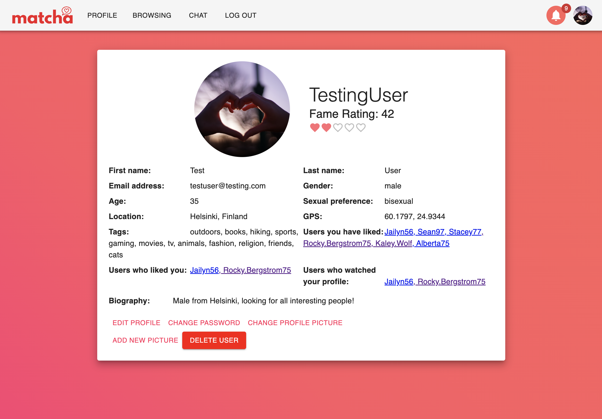
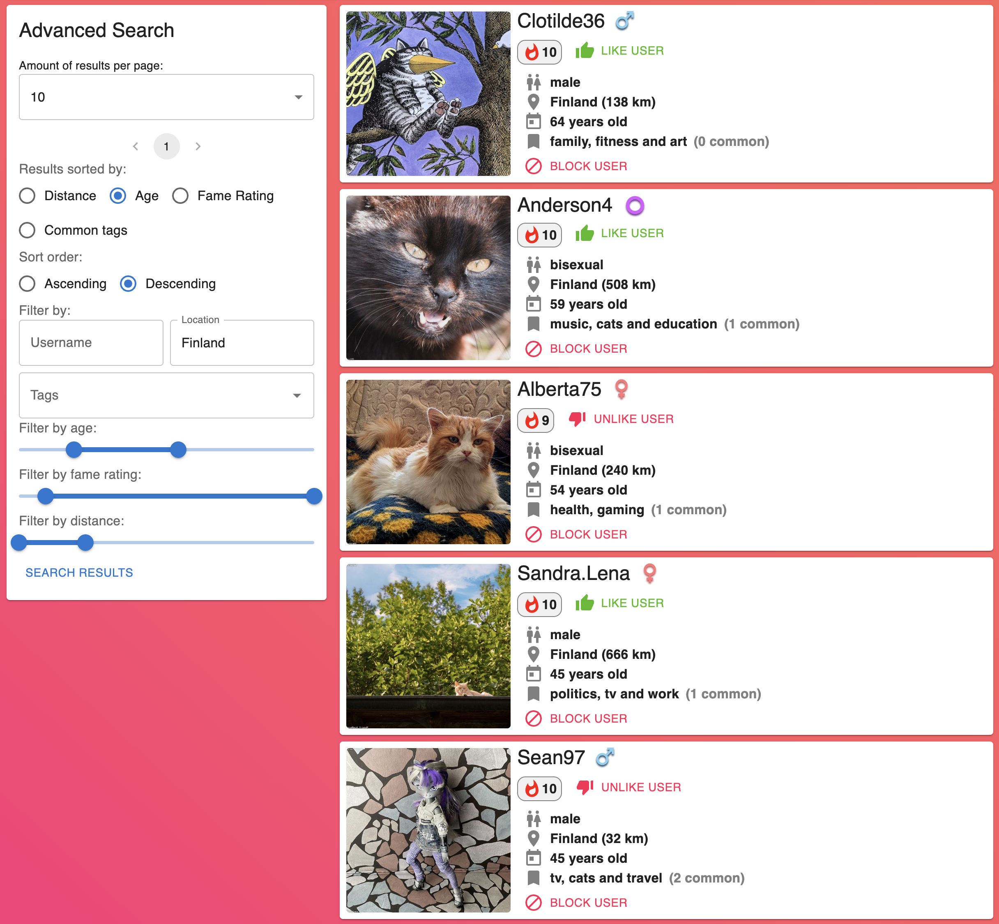
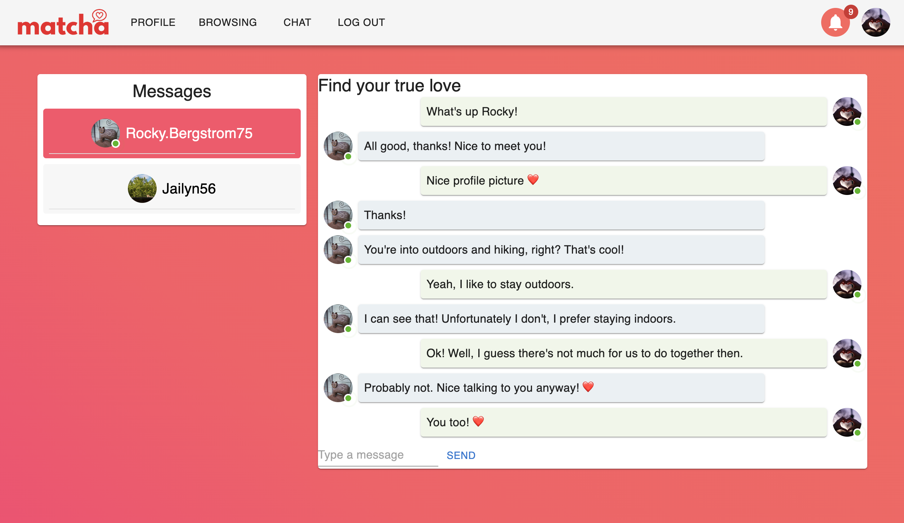
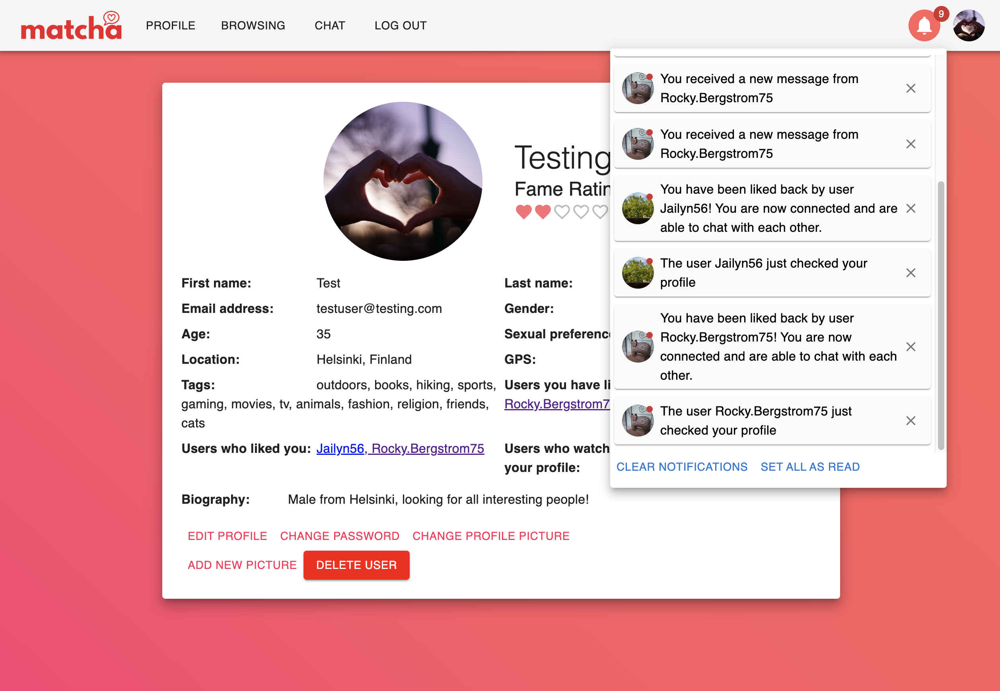

# Matcha - Dating Site


## 💼 Made by [SeanTroy](https://github.com/SeanTroy) and [erikpeik](https://github.com/erikpeik)

### Matcha is a dating site where you can find your soulmate
## 🎯 Projects goal:
It's a project for the Web branch of the 42 school curriculum.
The goal of the project is:

- to create a dating site from scratch using Node.js, Express, React, Redux, and PostgreSQL. The site works in real time, meaning that any updates happen instantly without the need to refresh the page.
- to learn the use of micro-frameworks and ability to build a web application that can be used by a large number of users.
- to learn how to use Docker and Docker Compose to create a development environment that is easy to set up and use.

## 📚 Technologies used:
| Node.js | HTML |   React    | Redux | PostgreSQL
|---------|------|------------|-------|-------------|
| Express | CSS  | JavaScript | Axios | Material UI |

## 📝 Features:
Works like most of dating apps, but here are some of the features:
- User registration and login with email verification
- User can edit his profile
- User can search for other users
- User can like other users
- User can see who liked him
- User can see who visited his profile
- User can chat with other users
- User can see who is online

## ⚙️ Installation:
Please make sure you have [Docker](https://www.docker.com/) installed on your machine.

1. Clone the repository
2. Create `.env` file is required to run the project in the root directory.
```
EMAIL_ADDRESS = <your email address>
EMAIL_PASSWORD = <your email password>
```
3. Run `docker-compose up --build` in the root directory
4. Go to `localhost:3000` in your browser
5. Enjoy!


## How it was done

We used Redux Store in React to store information about the connected user, to avoid constantly passing variables from component to another. SocketIO library is used for the instant chat and notifications between users. On top level of the client (in App.js), we always fetch the needed profile data, user lists and notifications, and open a socket to the back end, so the user can refresh any page and the required data is always there. We also use React Router in App.js to route according to the URL. The frontend design is mostly done with Material UI elements.

### Registration and Signing-in



On the signup page (components/Signup.js), a form is asking user for the required data to create a user profile. All of this data is also checked in the backend for length and correct format, and existing usernames and e-mails are also prevented. If all of the data is entered correctly, the variables are saved in to database (password of course as a BCrypt encrypted string).

A verify code is also saved into database, and an e-mail is sent to user using Nodemailer, with a link containing their username and verify code. By clicking this link, the user is forwarded to a password confirm page, and if the code matches the one in the database, the account is set as verified and user is able to log in.

### User profile


When logging in for the first time, the user has to provide additional information for their profile (in components/profile/ProfileSetUpForm.js).

The geolocation of the user is fetched using the GPS in the browser, or if that’s not allowed, using their IP address from IPApi. User can modify all of these themselves, or use the locate button, which will update the coordinates and the location to the ones fetched from the API.

Tags field accepts user’s own input, and it will suggest all of the tags which are already in the database, to avoid unnecessary almost similar tags.

User can also upload a profile picture and up to 4 other pictures here if they want. These are sent to the backend using a FormData object, and then saved to a file in the server using Multer. The folder with the images is served as a static folder to URL path ‘/images’, and the address of the image is saved to the database.



After correctly providing all of the information, the user is taken to their profile (components/Profile.js).

Here they can view and change all of the details, or delete their whole account if they wish. The user can also see everyone who has either watched or liked their profile, and also the profiles which they have liked themselves.

The fame rating for the user is created using the following formula, on a scale of 0-100:

- 5 points for profile set up
- 2 points for each uploaded picture (maximum 10 points)
- 1 point for each tag (maximum 5 points)
- 10 points for each ‘like’ they get (maximum 50 points)
- 5 points for each ‘match’ they make (a ‘like’ in both directions, maximum 30 points)

### Browsing


This is where the fun starts!

In the browsing section (components/Browsing.js), the user first gets to see the profiles recommended to them. The profiles are first filtered according to user’s sexual preference and a set maximum distance, and then those with at least one common tag are sorted by a value, which is formed by dividing the distance from the user by the amount of common tags to the power of 2. :) Not the most sophisticated algorithm perhaps, but it’s a start! The user can also sort the recommended users by any criteria they want.

(The distance between the users is calculated from the geo coordinates in a PostgreSQL function, which can be seen in db/init.sql.)



Lower in the same page we have the Advanced Search, with pagination, sorting and filtering options for all the users in the database.

The slider filters have to be locked by pressing the ‘Search Results’ button, to avoid constant requests from being made while user drags the slider. Pressing the button then sends a new PostgreSQL request to the database. The sorting, and the username, location, and tag filtering are done in the frontend.

Using the Block button instantly hides the profile, and it will not show up in the search results anymore, neither can the blocked user see our user profile anymore.

In the Redux store we have user lists for blocked, liked and connected users, retrieved from the database where ever needed, and updated instantly on every change.

### Profile of other users


By clicking any profile, the user is taken to that profile page, where we can see most of the user information (but not email and password of course).

If the other user is online, we see an 'online' badge next to their name. Information about online users are updated instantly via SocketIO to the Redux store every time a user logs in, logs out, refreshes the page or closes it.

By clicking the ‘report as fake account’ button, an email is sent to the admin so they can further investigate the profile.

If both of the users have liked each other, we can see that they are connected, and clicking the ‘connected’ button will open up the chat window.

### Chat



Whenever two users have liked each other, a connection is added to the database. And when they click on the other users name in the chat window, they join a room by the name of that connection_id, via SocketIO.

Whenever the user joins a room, the messages for that room are retrieved from the database. When a user sends a message, that message is sent to the backend via SocketIO, with information about the sender, receiver and message room. There, if the connection_id still exists, the message is saved to the database and forwarded back to frontend with the room id. In React, a received message is added to Redux store, and the updated messages from Redux are displayed on screen instantly for both users.

Also, when a user logs in, they join a notification room with the name of their user id, so they will instantly receive notifications in the top right corner for certain events.

### Notifications



Notifications are received for the following events:

- The user received a “like”.
- The user’s profile has been checked.
- The user received a message.
- A “liked” user “liked” back.
- A connected user “unliked” you.

Notifications are transmitted via SocketIO, and also saved to the database, from where they are retrieved to Redux store every time the user logs in. When a new notification is dispatched to Redux, that updates the Notification menu icon instantly with the number of unread notifications.

Clicking on the notifications forwards the user to the other user’s profile page, or to their chat room, depending on the notification type. At the bottom of the window, user has the option to delete all the notifications or set them all read.
